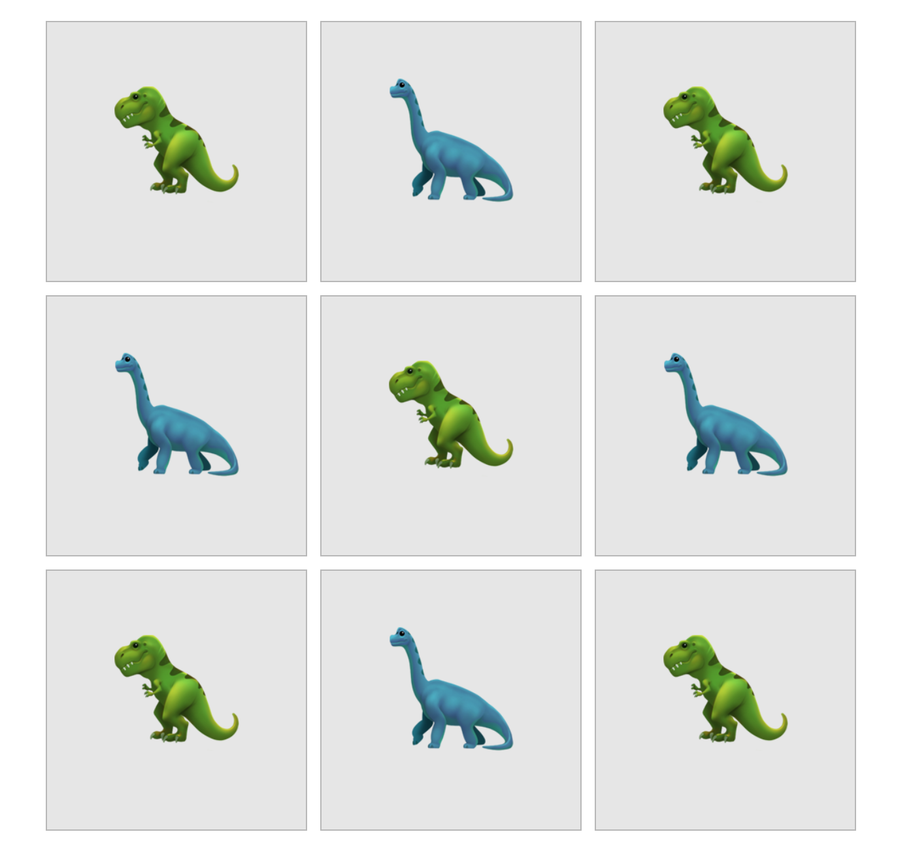

footer: CSS Grid Meetup, Nov. 2017
build-lists: true

# [fit] CSS Grid Meetup

## Aarhus, November 2017

---

# CSS Grid


---

# [fit] Basics

---

## Basics



* Container
* Rækker (rows)
* Kolonner (columns)
* Mellemrum (gap)

---

## Basics

```less
ul {
  display: grid;
}
```

---

## Basics

```less
ul {
  display: grid;
  grid-template-rows: 200px 200px 200px;
}
```

---

## Basics

```less
ul {
  display: grid;
  grid-template-rows: 200px 200px 200px;
  grid-template-columns: 200px 200px 200px;
}
```

---

## Basics

```less
ul {
  display: grid;
  grid-template-rows: 200px 200px 200px;
  grid-template-columns: 200px 200px 200px;
  grid-gap: 10px;
}
```

^ Der er heldigvis en funktion til repeating cols/rows

---

## Basics

```less, [.highlight: 3,4]
ul {
  display: grid;
  grid-template-rows: repeat(3, 200px);
  grid-template-columns: repeat(3, 200px);
  grid-gap: 10px;
}
```

---

> **“Lad os da lige prøve…”**

^ examples/basics-start.html

---

# [fit] Advanced

---

# Ny CSS unit: `fr`

(**fr**action)

```less
grid-template-columns: 2fr 1fr 3fr;
```

Deler "resten" op i dele (efter `grid-gap` er trukket fra)

---

> **“Lad os da lige prøve det også…”**

^ examples/advanced-start.html

---

# [fit] Explicit placering

^ Indtil videre har vi ladet tingene "falde på plads"

---

```less
ul {
	display: grid;
	grid-template-rows: 100px 200px 200px;
	grid-template-columns: repeat(6, 100px);
}
```

---

```less, [.highlight: 8-9]
ul {
	display: grid;
	grid-template-rows: 100px 200px 200px;
	grid-template-columns: repeat(6, 100px);
}

li:nth-child(2) {
	grid-column: 5;
	grid-row: 2;
}
```

^ Grid *lines*, *tracks* etc.

---

```less, [.highlight: 8]
ul {
	display: grid;
	grid-template-rows: 100px 200px 200px;
	grid-template-columns: repeat(6, 100px);
}

li:nth-child(2) {
	grid-column: 5 / span 2;
	grid-row: 2;
}
```

---

## [fit] _CSS_

^ Lad os rode med det også...

---

# [fit] Fallback??

## Hvad med *XYZ* browser? 

---

# [fit] `@supports()`

---

```less
.page {
  display: grid;
  grid-template-columns: repeat(3, 200px);
}
```

---

```less
.page {
  display: grid;
  grid-template-columns: repeat(3, 200px);
}
```

# :arrow_double_down:

```less, [.highlight: 1,6]
@supports(display: grid) {
  .page {
    display: grid;
    grid-template-columns: repeat(3, 200px);
  }
}
```

^ Hvis `grid` er supporteret, er `@supports()` også!

---

> Lad os alle kode...

^ 2 eller 3 sammen

^ Lige et par links til hvis man sidder fast...

---

# Links

Rachel Andrew: [Grid by Example](https://gridbyexample.com) (`gridbyexample.com`)

Jen Simmons: [Layout Lab](http://labs.jensimmons.com) (`labs.jensimmons.com`)


